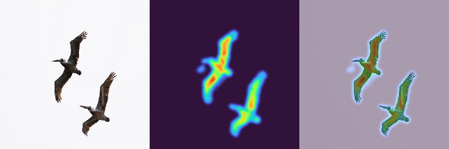
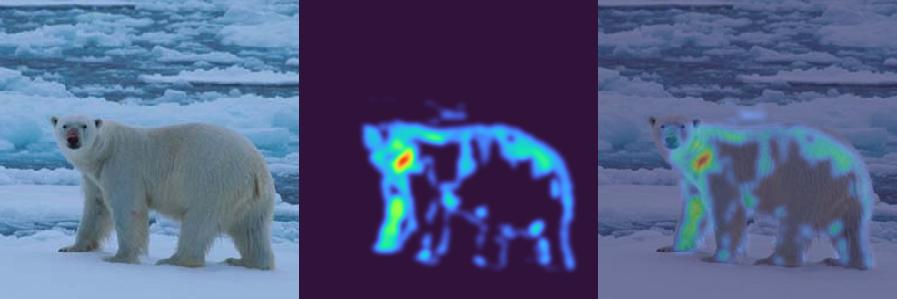
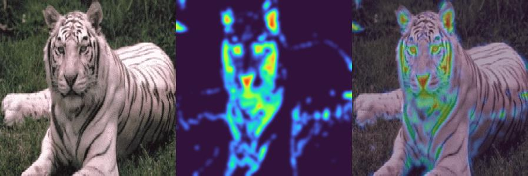
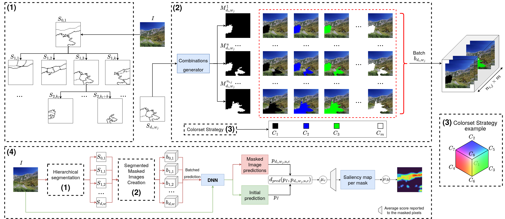

# H2O
Implementation of H²O: Heatmaps by Hierarchical Occlusion for tensorflow/python.

Visual results of the execution of H2O on three images taken from the Imagenet dataset.





## Description

This code provides an implementation of H2O to explain the prediction vector produced by a model in the context of image classification tasks. 
The method is : 
- Model-Agnostic: Any image classification model can be explained.
- Class-Agnostic: The method produces one heatmap to explain all the classes at once.
- Hierarchical: The method leverages a hierarchical segmentation algorithm.
- Occlusion-based: The method repetitively alters the input image in various ways. It then evaluates the relative importance of the altered pixels by measuring the deteriorations induced on the prediction vector. 

The method hierarchically segments an input imag. For each level in the hierarchy, H2O builds a binary mask for each combination of superpixels. 
Each mask is used to alter the input image with *m* different colors. The altered images are fed to the model. The difference between the prediction of the input image and the prediction of the altered image is used to compute an importance score for the masked pixels, hierarchically.
These scores are aggregated into the final saliency map. 




## Usage

To repository is composed of: 
- The dependencies of H2O [``requirements.txt``]
- The implmentation of H2O, the explanation method [``h2o.py``]
- An example of its usage [``h2o_example.py``]
- Three image examples taken from the Imagenet dataset [``./imagenet/``]
- The output heatmaps of H2O on the three provided images [``./results_demo/``]

> ⚠️ **_NOTE:_** The code in this repository has been used with the version ``2.11.0`` of tensorflow. It has not been tested with other versions. The use of other versions is left to your discretion. 

To use this code with your own data: 
1. Replace the image examples with yours,
2. Replace the provided model with yours in ``Main_H2O.__init()`` in step 1),
3. Change the target image size to the one that fits your task,
3. Modify the H2O parameters when creating the object in ``Main_H2O.__init()`` in step 2).

For this last step, you should provide your own ``predict_fct`` as H2O is implemented in a model-agnostic way (not only for tensorflow neural networks) and the target number of classes in your classification task. 
We suggest to leave the two other parameters (``n`` and ``min_size``) at their default values.

Depending on your equipment, you may significantly speed-up the computation time compared to the default value by increasing the initial value of the ``step`` variable in the method ``H2O.compute_predictions()``. This variable controls the batch size when the altered images are predicted. 

## Reference

This work has been accepted for publication at CBMI 2023. Please cite this work if you use it:

```
Luc-Etienne Pommé, Romain Bourqui, and Romain Giot. 2023. H2O: Heatmap
by Hierarchical Occlusion. In Proceedings of Content-based Multimedia In-
dexing (CBMI2023).
```
